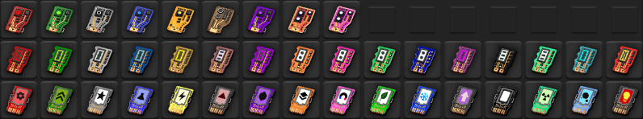

# Spaghetorio

Adds lots of new ores, items, buildings and technologies.

Inspired by [brevven](https://mods.factorio.com/user/brevven).

## Features

- 25 new resources like **chromite**, **core-rift**, **iodine-brine** and **blunagium**
- over 550 new items like **inconel**, **copper tube**, **gear box**, **processor** and of course **dark energy harvester**
- over 50 new fluids like **aqueous niobium**, **helium 3**, **glycerin** and **chronomatter**
- over 40 new buildings like **alloy forge**, **induction hardening facility** and **electrolysis plant**
- over 650 new recipes including different paths of processing resources and intermediate products
- 30 new science packs split into 3 different tiers
- over 200 new techonolgies

## Compatibility

- Requires Space Age DLC
- Requires [Everything on Nauvis](https://mods.factorio.com/mod/EverythingOnNauvis)
- Compatible with [AAI Containers & Warehouses](https://mods.factorio.com/mod/aai-containers) by [Earendel](https://mods.factorio.com/user/Earendel)

## Current state of the mod

This mod is in early alpha. In my current playthrough I can finish the first tier of science packs (about 150h taking it casually). The mod contains 3 tiers of science pack:

- Basic science pack (9 variations like **electronic**, **material** and **geological** science)
- Intermediate science pack (16 variations like **computer** and **nuclear** science)
- Advanced science pack (16 variations like **matter** and **uniformity** science)

For the recipes unlocked during first tier there are no plans to change anything (except mabe change some ratios). All recipes comming after allready exist, but might not be reachable through tech tree.

I am currently cleaning up the second science tier in tech tree which is the longest and most complex phase in the development. I want to publish my mod now, because I need some help and gather feedback to tune in the balance.

If you have some cool ideas you can give me feedback in the discussions section.

## Future plans

- Breeder reactor for acquiring radioactive isotopes.
- Clyclotron acquiring super heavy elements (and maybe reach the island of stability).
- Particle accelerator for completing the standard model.
- Quantum stabilizer to make use for acquired knowledge from particle accelerator.
- Pathogen lab for an extense biological tech branch.
- Freezer for freezing biological / spoilable items.
- Support for [text plates](https://mods.factorio.com/mod/textplates?from=search)

## Special Thanks

- [Hurricane046](https://mods.factorio.com/user/Hurricane046) for his awesome [graphics](https://www.figma.com/proto/y1IQG08ZG2jIeJ5sTyF4MP/Factorio-Buildings?node-id=14934-304&node-type=frame&t=tk88gXWNIga60zMr-0&scaling=scale-down-width&content-scaling=fixed&page-id=0%3A1&starting-point-node-id=2585%3A1158&hotspot-hints=0&hide-ui=1)
- [raiguard](https://mods.factorio.com/user/raiguard) for [Krastorio 2](https://mods.factorio.com/mod/Krastorio2) and letting me use some of his awesome graphics
